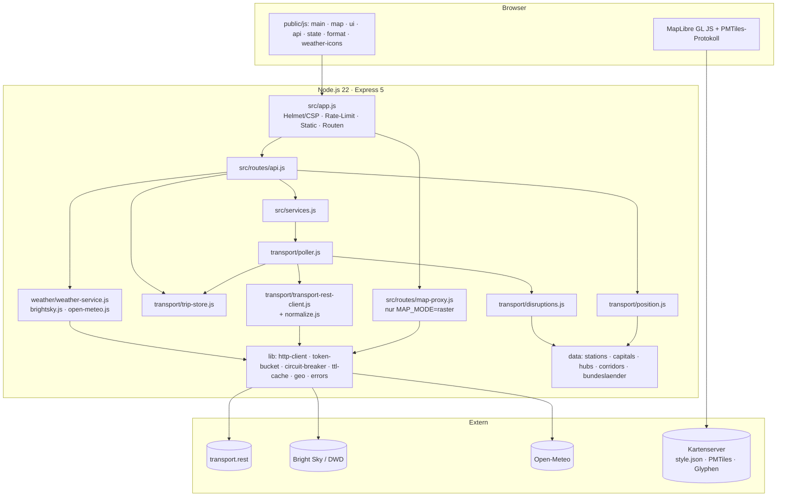

# Architektur

## 1. Überblick

## 2. Komponenten

| Komponente | Datei(en) | Verantwortung |
|---|---|---|
| Konfiguration | `src/config.js` | Validierte Umgebungsvariablen, abgeleitete Allowlists/CSP-Origins, öffentlicher Konfigurationsauszug |
| Logger | `src/logger.js` | JSON-Zeilen-Logging, IP-Anonymisierung |
| HTTP-Client | `src/lib/http-client.js` | Ausgehende Anfragen mit Origin-Allowlist, Timeout, Größenlimit, Retry/Backoff |
| Budget und Schutz | `src/lib/token-bucket.js`, `src/lib/circuit-breaker.js`, `src/lib/ttl-cache.js` | Anfragebudget, Ausfallschutz, Caches mit TTL/LRU |
| Geodäsie | `src/lib/geo.js` | Distanzen, Kurs, Interpolation entlang Linien, Snapping |
| Stammdaten | `src/data/*.js`, `*.json` | Stationsverzeichnis, Landeshauptstädte, Knotenbahnhöfe, ICE-Korridore, Bundesländer |
| Upstream-Adapter | `src/transport/transport-rest-client.js`, `normalize.js` | Anfragen an transport.rest, Normalisierung in interne Modelle |
| Fahrtenspeicher | `src/transport/trip-store.js` | In-Memory-Speicher der verfolgten Fahrten mit Metadaten |
| Poller | `src/transport/poller.js` | Discovery über Abfahrtstafeln, priorisierte Aktualisierung, Bereinigung, Boards-Cache |
| Position | `src/transport/position.js` | Zeitliche Interpolation, Statusklassifikation, GeoJSON-Features |
| Störungen | `src/transport/disruptions.js` | Aggregation und Kategorisierung von Warnmeldungen, Halte-/Abschnittserkennung |
| Wetter | `src/weather/*.js` | Provider-Kette (Bright Sky, Open-Meteo), Warnungen, Punktabfragen |
| HTTP-Schicht | `src/app.js`, `src/routes/*.js`, `src/server.js` | Sicherheitsheader, Rate-Limit, API, statische Dateien, Lebenszyklus |
| Frontend | `public/` | Karte, Seitenleiste, Detailansichten, Rechtstext-Vorlagen |
| Werkzeuge | `scripts/` | Vendor-Kopie, Korridor-Build, Mock-Upstream, Demo, Lint |

## 3. Datenfluss

1. **Discovery.** Der Poller fragt reihum die Abfahrtstafeln der Knotenbahnhöfe ab (Stufe 1 alle 10 min,
   Stufe 2 alle 20 min). Jede unbekannte Trip-ID wird als Seed im Trip-Store angelegt.
2. **Aktualisierung.** Innerhalb des Budgets (Token-Bucket, Standard 40/min, 20 % Reserve) lädt der Poller
   Fahrten über `/trips/:id` (Halte, Hinweise, Polyline) – priorisiert nach Dringlichkeit und Datenalter.
3. **Normalisierung.** Rohantworten werden defensiv in die internen Modelle `Trip`, `Stopover`, `Departure`,
   `Remark` überführt; fehlende Koordinaten werden aus dem Stationsverzeichnis ergänzt.
4. **Ableitung.** Störungen werden aus den Hinweisen aggregiert; Positionen werden erst bei einer Anfrage
   für den aktuellen Zeitpunkt berechnet (rein aus dem Cache, ohne Upstream-Zugriff).
5. **Auslieferung.** `/api/trains` liefert eine GeoJSON-FeatureCollection; das Frontend fragt sie alle 15 s ab
   und animiert die Bewegung zwischen zwei Abfragen.
6. **Wetter.** Unabhängiger Zyklus (10 min) für die 16 Landeshauptstädte, Provider-Kette mit Fallback.

## 4. Interne Modelle

Siehe JSDoc in `src/transport/normalize.js`. Kernfelder:

* `Trip`: `id`, `lineName`, `product`, `fahrtNr`, `direction`, `origin`, `destination`, `stopovers[]`, `remarks[]`,
  `polyline` (`[lon,lat][]|null`), `cancelled`, `loadFactor`, `realtimeDataUpdatedAt`, `fetchedAt`.
* `Stopover`: `stop {id,name,lat,lon}`, `plannedArrival/arrival/arrivalDelaySec`, `plannedDeparture/departure/departureDelaySec`,
  Gleise (geplant/aktuell), `cancelled`, `loadFactor`, `remarks[]`.
* `Position`: `lon`, `lat`, `bearing`, `state`, `source`, `status`, `delaySec/delayMin`, `prevStop`, `nextStop`, `speedKmh`.
* `Disruption`: `id`, `category`, `severity`, `summary`, `text`, `affectedTrips[]`, `affectedStops[]`, `segment`.

## 5. Laufzeitverhalten und Grenzen

| Größe | Standard | Begründung |
|---|---|---|
| Upstream-Budget | 40 Anfragen/min | Unter dem Limit von transport.rest (100/min) und des DB-Backends (~60/min) |
| Knoten-Abfrage | ~100 Bahnhöfe, 2,6 + 2 Anfragen/min | Deckt praktisch alle Fernverkehrsfahrten innerhalb einer Stunde ab |
| Fahrt-Aktualisierung | ≥ 180 s Abstand, priorisiert | Bei ~150 laufenden ICE ergibt sich ein Datenalter von 2–5 min |
| Verfolgte Fahrten | max. 400 | Speicher- und Budgetgrenze |
| Client-Rate-Limit | 120 Anfragen/min/IP | Frontend benötigt ~8/min |
| Datenalter im Frontend | 15 s Abfrage, Tween 15 s | Flüssige Darstellung ohne zusätzliche Upstream-Last |

## 6. Erweiterungspunkte

* **Andere Datenquelle:** `createTransportClient` durch einen Adapter mit gleicher Schnittstelle ersetzen
  (z. B. eigene db-rest-Instanz – nur `TRANSPORT_API_BASE_URL` ändern; DB API Marketplace/RIS; MOTIS/GTFS-RT).
* **Weitere Wetteranbieter:** Provider-Objekt `{name, current(points), alerts?(points)}` in `weather-service.js` registrieren.
* **Amtliche Streckengeometrie:** `src/data/ice-corridors.geo.json` durch Daten aus dem DB-Geo-Streckennetz ersetzen
  (gleiche Properties `id, name, kind, vmax, lines, stops`).
* **Persistenz:** Trip-Store ist speicherbasiert; ein Neustart beginnt mit leerem Zustand (Aufwärmzeit ≈ 1–2 Poll-Zyklen).
