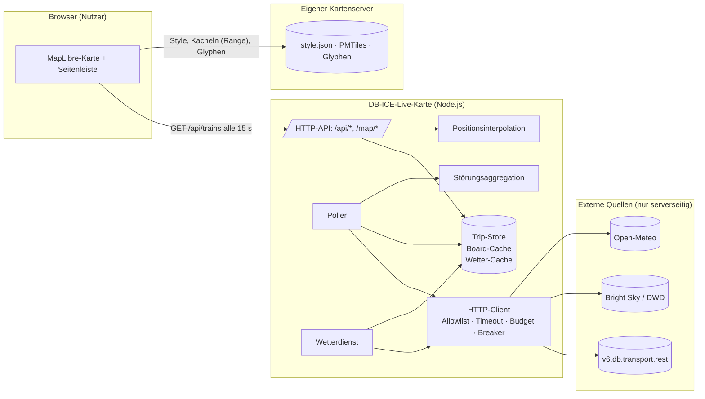
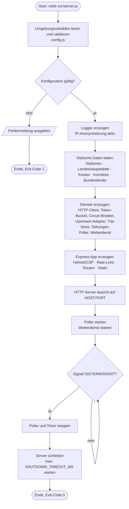
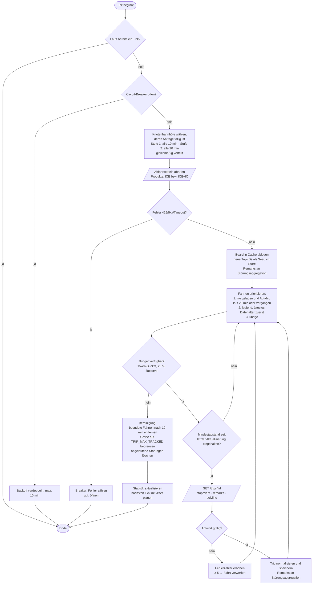
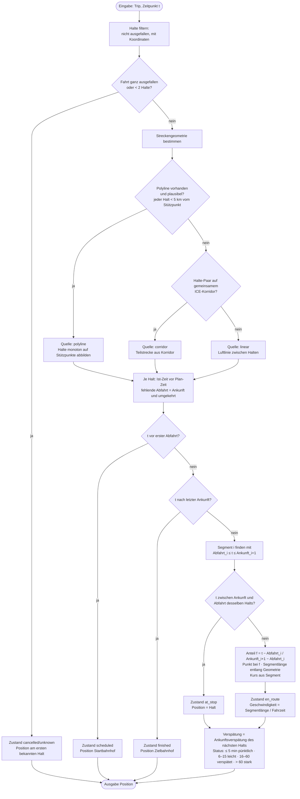
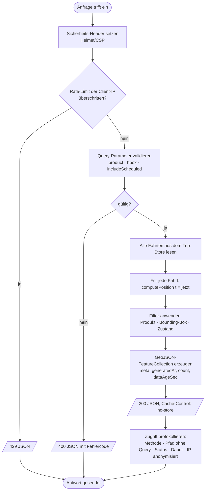
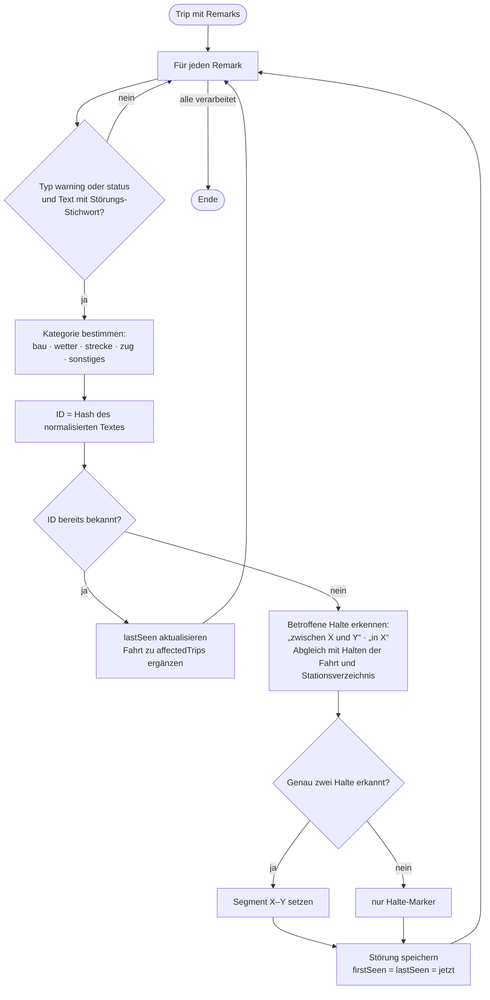
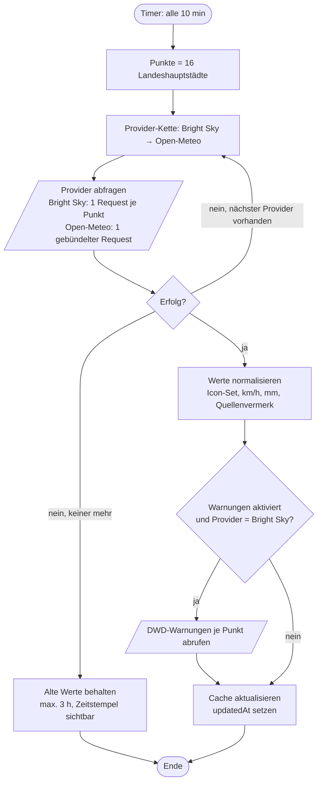
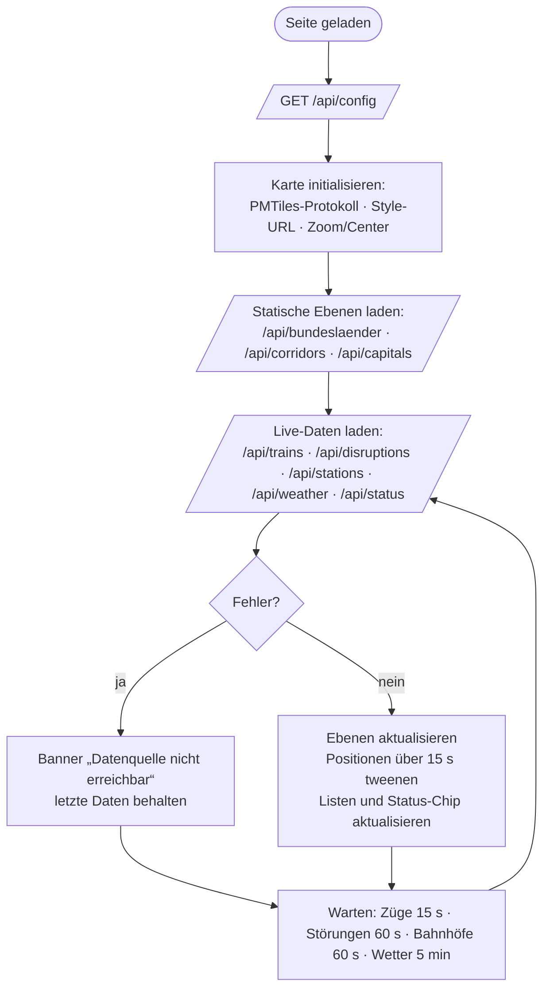

# Programmablaufplan (PAP)

Die Diagramme sind in [Mermaid](https://mermaid.js.org/) notiert und werden von GitHub, GitLab und den meisten
Markdown-Editoren gerendert. Symbole nach DIN 66001: Rechteck = Verarbeitung, Raute = Entscheidung, abgerundet =
Start/Ende, Parallelogramm = Ein-/Ausgabe.

## 1. Gesamtsystem (Datenfluss)

## 2. Serverstart

## 3. Poller-Zyklus (Discovery, Aktualisierung, Bereinigung)

## 4. Positionsberechnung einer Fahrt (computePosition)

## 5. Bearbeitung einer Client-Anfrage (GET /api/trains)

## 6. Störungsaggregation (ingestTrip)

## 7. Wetteraktualisierung

## 8. Frontend-Aktualisierungsschleife

