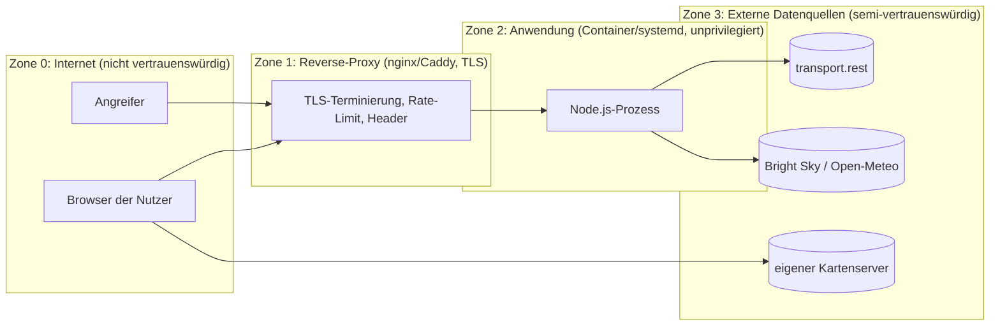

# Sicherheitskonzept

Dieses Dokument beschreibt das Bedrohungsmodell, die umgesetzten Schutzmaßnahmen und den Betriebsprozess
(Meldeweg, Aktualisierung). Es orientiert sich am BSI-Grundschutz-Baustein APP.3.1 (Webanwendungen und Webservices),
der OWASP Top 10 (2021) und dem OWASP Application Security Verification Standard (ASVS, Level 1).

## 1. Schutzziele und Einordnung

| Schutzziel | Einordnung | Begründung |
|---|---|---|
| Vertraulichkeit | niedrig | Es werden ausschließlich öffentliche Daten verarbeitet; keine Konten, keine Nutzerdaten außer IP-Adressen in Logs (anonymisiert). |
| Integrität | mittel | Manipulierte Anzeigen (falsche Verspätungen/Störungen) könnten Reisende irreführen; die App weist auf den inoffiziellen Charakter hin. |
| Verfügbarkeit | mittel | Ausfall ist unkritisch, aber die Anwendung darf nicht als Verstärker für Angriffe auf Fremd-APIs dienen (Fair Use). |

## 2. Systemgrenzen und Vertrauenszonen

Grundsätze: Der Browser spricht nur mit dem eigenen Server und dem eigenen Kartenserver. Die Anwendung kontaktiert
ausschließlich die konfigurierten Origins (Allowlist). Daten aus Zone 3 gelten als **nicht vertrauenswürdig** und werden
vor der Verarbeitung validiert und normalisiert.

## 3. Bedrohungsmodell (STRIDE)

| Bedrohung | Szenario | Maßnahme | Status |
|---|---|---|---|
| **S**poofing | Gefälschte Upstream-Antworten (MITM) | Ausschließlich HTTPS zu den Datenquellen (Standardkonfiguration); Zertifikatsprüfung durch Node.js; keine Deaktivierung von TLS-Prüfungen | umgesetzt |
| **T**ampering | Manipulierte JSON-Antworten (falsche Typen, riesige Felder, Prototype-Pollution-Muster) | Defensive Normalisierung (`normalize.js`): Typprüfung je Feld, unbekannte Felder werden verworfen, Antwortgröße ≤ 5 MB, keine `__proto__`-Übernahme durch Objektaufbau per Whitelist | umgesetzt |
| **T**ampering | Cross-Site-Scripting über Bahnhofsnamen, Störungstexte, Zugziele | Frontend baut alle Inhalte über DOM-APIs (`textContent`, `createElement`); Lint verbietet `innerHTML` mit Template-Strings; CSP `script-src 'self'` ohne `unsafe-inline` als zweite Verteidigungslinie | umgesetzt |
| **R**epudiation | Nachvollziehbarkeit von Missbrauch | Strukturierte Zugriffslogs (Methode, Pfad, Status, Dauer, anonymisierte IP, Zeitstempel); Aufbewahrung 7 Tage (Rotation im Betrieb konfigurieren) | umgesetzt / betrieblich |
| **I**nformation Disclosure | Stacktraces, interne URLs, Versionen | Zentraler Fehler-Handler liefert nur `{error:{code,message}}`; `x-powered-by` entfernt; `/api/config` enthält keine internen Upstream-URLs; Server-Logs enthalten keine Query-Strings | umgesetzt |
| **D**enial of Service | Flut von Anfragen an `/api/*` | Rate-Limit pro Client-IP (Standard 120/min), zusätzlich `limit_req` im Reverse-Proxy; alle Live-Antworten stammen aus dem Cache (O(n) Interpolation, keine Upstream-Anfrage pro Client) | umgesetzt |
| **D**enial of Service | Erschöpfung des Upstream-Kontingents (Blockierung durch DB/transport.rest) | Token-Bucket (40/min), Circuit-Breaker mit Backoff, Mindestabstand pro Fahrt, On-Demand-Abfragen nur aus Reserve-Budget, Board-Cache 60 s | umgesetzt |
| **D**enial of Service | Speicherwachstum (unbegrenzte Caches) | Alle Caches mit Größen- und Zeitgrenzen (`TRIP_MAX_TRACKED`, TTL-Caches mit LRU) | umgesetzt |
| **E**levation of Privilege | Server-Side Request Forgery über Parameter (z. B. Kachel-Proxy, Trip-IDs) | HTTP-Client prüft Origin-Allowlist **vor** jedem Request; Pfadparameter werden strikt validiert und URL-kodiert; Redirects werden nicht gefolgt; Raster-Proxy nur bei `MAP_MODE=raster` und nur für z/x/y-Ganzzahlen | umgesetzt |
| **E**levation of Privilege | Ausbruch aus dem Prozess (RCE über Abhängigkeiten) | Minimale Abhängigkeiten (3 Laufzeitpakete), `npm audit` in CI, Dependabot, Container ohne Root, read-only Dateisystem, `cap_drop ALL`, systemd-Härtung | umgesetzt / betrieblich |
| Clickjacking | Einbettung in fremde Seiten | `frame-ancestors 'none'`, `X-Frame-Options: DENY` (Helmet) | umgesetzt |
| Supply Chain | Kompromittierte CDN-Skripte | Keine CDNs; Bibliotheken aus `node_modules` (Lockfile, Integritätshashes) nach `public/vendor/` kopiert | umgesetzt |
| Datenschutz | Übermittlung von Nutzerdaten an Dritte | Keine Drittanbieter im Browser; Upstream-Anfragen enthalten keine Nutzerdaten; IP-Anonymisierung vor dem Logging | umgesetzt |

## 4. Umgesetzte Maßnahmen im Detail

### 4.1 HTTP-Sicherheitsheader (Helmet)

* `Content-Security-Policy`: `default-src 'none'; script-src 'self'; style-src 'self'; img-src 'self' data: blob: <Karten-Origins>;
  connect-src 'self' <Karten-Origins>; worker-src 'self' blob:; child-src blob:; font-src 'self'; manifest-src 'self';
  base-uri 'none'; form-action 'self'; frame-ancestors 'none'; object-src 'none'`.
  Die Karten-Origins werden aus `MAP_STYLE_URL` und `MAP_EXTRA_ORIGINS` abgeleitet.
* `Referrer-Policy: strict-origin-when-cross-origin`, `Permissions-Policy` (Geolocation, Kamera, Mikrofon, Zahlung, USB deaktiviert),
  `Cross-Origin-Opener-Policy: same-origin`, `X-Content-Type-Options: nosniff`, `X-Frame-Options: DENY`.
* `Strict-Transport-Security` nur bei `HSTS_ENABLED=true` (setzt TLS am Reverse-Proxy voraus).

### 4.2 Eingabevalidierung

Alle Parameter werden per Whitelist geprüft (`src/routes/validate.js`): EVA-Nummern `^\d{5,12}$`, Trip-IDs 5–512 druckbare Zeichen,
Produkte aus fester Liste, Bounding-Box als vier Zahlen in gültigen Bereichen, Koordinaten in Bereichsgrenzen, Suchbegriffe 2–64 Zeichen,
Kachelkoordinaten als Ganzzahlen im Zoombereich. Ungültige Eingaben → HTTP 400 mit maschinenlesbarem Fehlercode.

### 4.3 Ausgehende Verbindungen

`src/lib/http-client.js`: Origin-Allowlist (`security.allowedUpstreamOrigins`), Timeout (12 s), maximale Antwortgröße, keine Redirects,
Retry nur bei Netz-/5xx-Fehlern mit Backoff und Jitter, `User-Agent` mit Projekt-/Kontaktangabe (Fair Use, Ansprechbarkeit).

### 4.4 Ressourcenkontrolle

Token-Bucket und Circuit-Breaker (`src/lib/`), Poller-Budgetierung (`src/transport/poller.js`), TTL-/LRU-Caches, Rate-Limit für Clients
(`express-rate-limit`), Begrenzung der verfolgten Fahrten.

### 4.5 Protokollierung

JSON-Zeilen auf stdout (Sammlung über Container-/systemd-Journal). Inhalte: Zeitstempel, Level, Nachricht, Modul, Status, Dauer,
anonymisierte IP. Keine Query-Strings, keine Header, keine Nutzereingaben im Klartext. Fehler enthalten Stacktraces nur im Server-Log.

### 4.6 Betriebshärtung (siehe `deploy/`)

Container: `node:22-alpine`, `USER node`, `read_only`, `cap_drop: [ALL]`, `no-new-privileges`, Speicher-/PID-Limits, Healthcheck.
systemd: `DynamicUser`, `ProtectSystem=strict`, `ProtectHome`, `PrivateTmp`, `NoNewPrivileges`, `SystemCallFilter=@system-service`,
`RestrictAddressFamilies=AF_INET AF_INET6`. Reverse-Proxy: TLS 1.2+, HSTS, `limit_req`, Weiterleitung nur an 127.0.0.1.

### 4.7 Abhängigkeits- und Lieferkettenmanagement

`package-lock.json` mit Integritätshashes, `npm ci` in CI/Build, `npm audit --omit=dev --audit-level=high` in CI, Dependabot wöchentlich,
Vendor-Kopie der Browser-Bibliotheken mit Versionsdatei (`public/vendor/versions.json`).

## 5. Bewusst nicht umgesetzt (mit Begründung)

| Maßnahme | Begründung |
|---|---|
| Authentifizierung/Autorisierung | Keine personalisierten oder schützenswerten Funktionen; alle Daten öffentlich. Bei Bedarf Basic-Auth am Reverse-Proxy. |
| CSRF-Schutz | Keine zustandsändernden Endpunkte (nur GET), keine Cookies. |
| Cross-Origin-Embedder-Policy | Würde das Laden der Kartenressourcen ohne CORP-Header blockieren. |
| WAF | Angriffsfläche gering; Rate-Limit und strikte Validierung genügen für den Schutzbedarf. |

## 6. Prüfschritte vor jeder Veröffentlichung

1. `npm run lint && npm test` grün.
2. `npm audit --omit=dev --audit-level=high` ohne Befund (sonst Aktualisierung).
3. Manuelle Prüfung der Antwort-Header (`curl -I https://<host>/`) gegen Abschnitt 4.1.
4. Prüfung, dass `/api/config` und Fehlerantworten keine internen Informationen enthalten.
5. Rate-Limit-Test (`ab`/`hey`) gegen `/api/trains` → 429 nach Überschreitung.
6. Log-Stichprobe: IP-Adressen anonymisiert, keine Query-Strings.

## 7. Meldeweg und Reaktion

Sicherheitslücken bitte gemäß `SECURITY.md` melden (verschlüsselte E-Mail bevorzugt). Ziel-Reaktionszeiten: Eingangsbestätigung
innerhalb von 3 Werktagen, Behebung kritischer Lücken innerhalb von 14 Tagen. Bei Kompromittierung: Prozess stoppen, Container-Image
neu bauen, Secrets rotieren (keine vorhanden), Logs sichern, Vorfall dokumentieren; Meldepflichten nach Art. 33 DSGVO prüfen
(bei diesem Datenbestand in der Regel nicht einschlägig).
